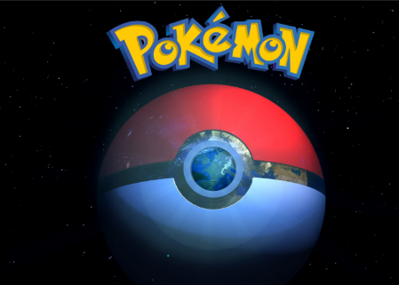
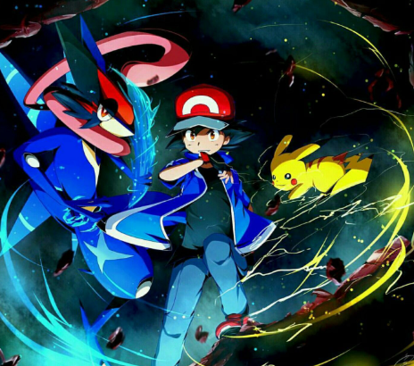
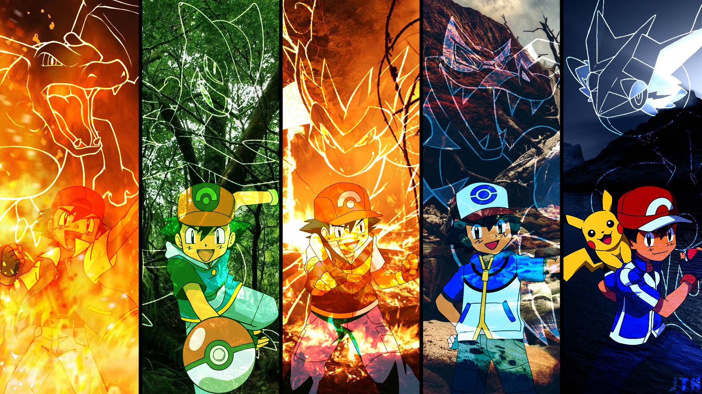

  

   <head>
      <link rel="icon" href="logo.png">
    </head>
<body bgcolor="black" style="color: black">
    

    <h> ~The journery starts today!~</h>
    
 This article is about the media franchise as a whole. For the video game series, see Pokémon (video game series). For the animated series, see Pokémon (TV series). For a list of creatures known as "Pokémon", see List of Pokémon. For other uses, see Pokémon (disambiguation).
       
      Pokémon[a][b] is a Japanese media franchise consisting of video games, animated series and films, a trading card game, and other related media. The franchise takes place in a shared universe in which humans co-exist with creatures known as Pokémon, a large variety of species endowed with special powers. The franchise's primary target audience is children aged 5 to 12,[2] but it is known to attract people of all ages.[I] Pokémon is estimated to be the world's highest-grossing media franchise and is one of the best-selling video game franchises.
 
The franchise originated as a pair of role-playing games developed by Game Freak, from an original concept by its founder, Satoshi Tajiri. Released on the Game Boy on 27 February 1996, the games became sleeper hits and were followed by manga series, a trading card game, and anime series and films. From 1998 to 2000, Pokémon was exported to the rest of the world, creating an unprecedented global phenomenon dubbed "Pokémania". By 2002, the craze had ended, after which Pokémon became a fixture in popular culture, with new products releasing to this day. In the summer of 2016, the franchise spawned a second craze with the release of Pokémon Go, an augmented reality game developed by Niantic.
 
Pokémon is jointly owned by publisher Nintendo and developers Game Freak and Creatures.[1] Game Freak develops the core series RPGs, which are published by Nintendo exclusively for their consoles, while Creatures manages the trading card game and related merchandise, occasionally developing spin-off titles. The three companies established The Pokémon Company (TPC) in 1998 to manage the Pokémon property within Asia. The Pokémon anime series and films are co-owned by a production committee consisting of various companies, including Shogakukan which holds the rights to the manga series. Since 2009, The Pokémon Company International (TPCi), a subsidiary of TPC, has managed the franchise in all regions outside Asia.
 
  

    

  

     Pokémon[a][b] is a Japanese media franchise consisting of video games, animated series and films, a trading card game, and other related media. The franchise takes place in a shared universe in which humans co-exist with creatures known as Pokémon, a large variety of species endowed with special powers. The franchise's primary target audience is children aged 5 to 12,[2] but it is known to attract people of all ages.[I] Pokémon is estimated to be the world's highest-grossing media franchise and is one of the best-selling video game franchises.4  
     

     

     
      
     <h1>General concept</h1>
     <h2>
      

      <a href="https://www.pokemongo.com/">See also: Pokémon (video game series) § Gameplay</a></h2>
      

      

     

      A Rocky Beginning: Initially, Pikachu disliked Ash and refused to obey him, even shocking him frequently.
       
The Turning Point: They bonded after Pikachu saved Ash from a flock of Spearow, and subsequently, Ash proved his devotion to Pikachu's safety.
 

Unwavering Loyalty: Pikachu consistently risks its life to protect Ash, and they refuse to be separated, often acting as a single unit in battles.
 
Refusal to Evolve: Despite opportunities to become a stronger Raichu, Pikachu refused, preferring to remain a Pikachu to prove its strength alongside Ash.
 
Symbolic Partnership: They represent the theme of friendship over raw power, ending their journey as champion-level partners. 

 

    
        <a href="https://en.wikipedia.org/wiki/Pok%C3%A9mon">CROWN EVENT</a>
        

        <h1>Contact</h1>
        <hi>7299667208 | brsd1985@gmail.com</hi>
        
The original full name of the franchise is Pocket Monsters (ポケットモンスター, Poketto Monsutā), which has been commonly abbreviated to Pokemon (ポケモン) since its launch. When the franchise was released internationally, the short form of the title was used, with an acute accent (´) over the e to aid in pronunciation.

